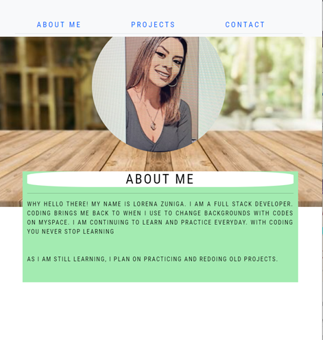

# Getting Started with Create React App
## Portfolio

## Description

The reason for the portfolio is to showcase my skills and talents to help me in the future when I am on a job search.
Links are working to designated sites and/or pages. Images have a hover over them. THis portfolio is still a work in progress. 

## Table of Contents


 * [Installation](#installation)
 * [User Story](#user-story)
* [Usage](#usage)
 * [License](#license)
 * [Built_With](#built-with)
 * [Questions](#questions)
 

## User Story

```
AS someone who is developing new skills and wants to show case them I WANT to have a portfolio that future employers can view.
```

## Usage 



```
Given the porfolio, WHEN I open the page, THEN I can click the links in the nav section. WHEN I scroll down, THEN I can click the images that will open projects previously worked on. When I continue to scroll down to the contact me section, THEN I can click the links of contact by phone, email, github & linkedin.
```

## Built With

* React
* Bootstrap
* CSS

## License 

None

## Questions
Reach out to me through [Github](www.github.com/lzvalentin) .